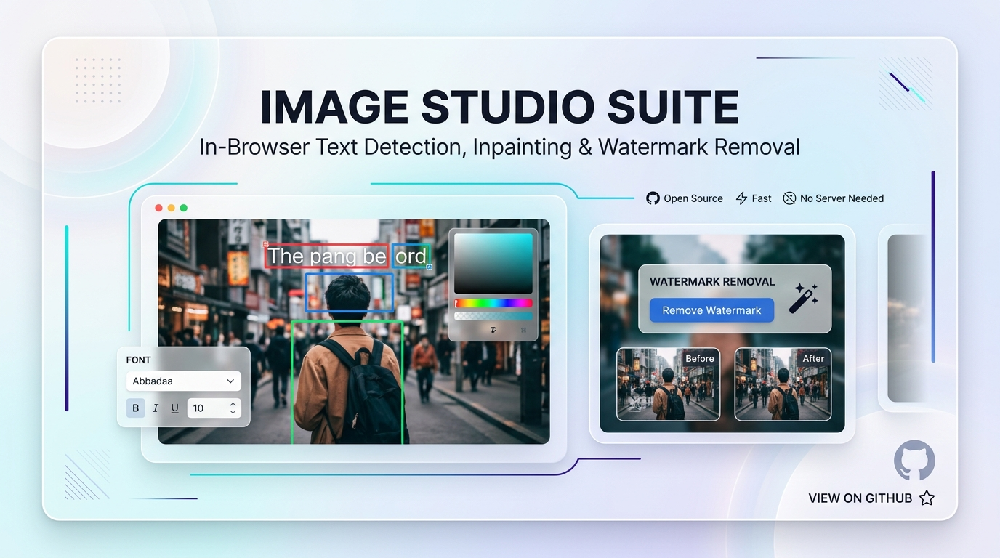
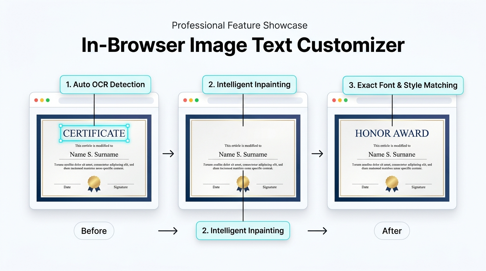
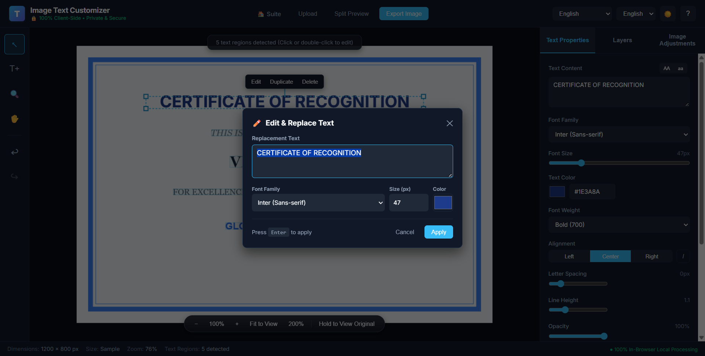
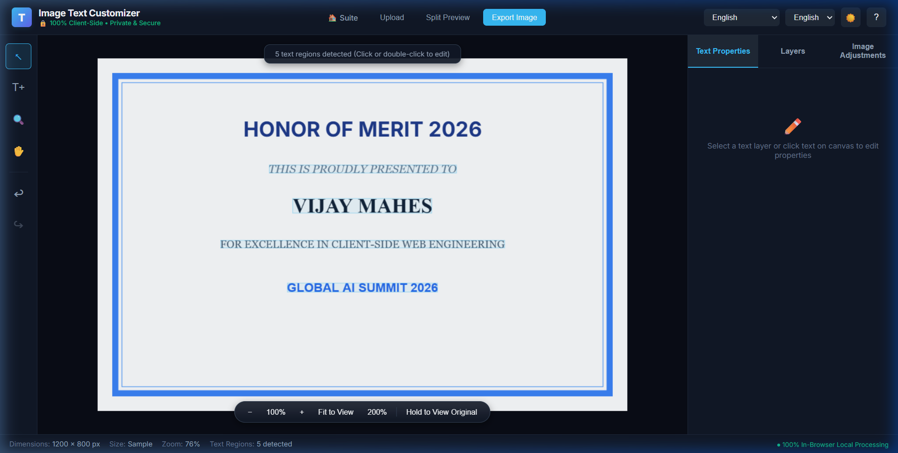
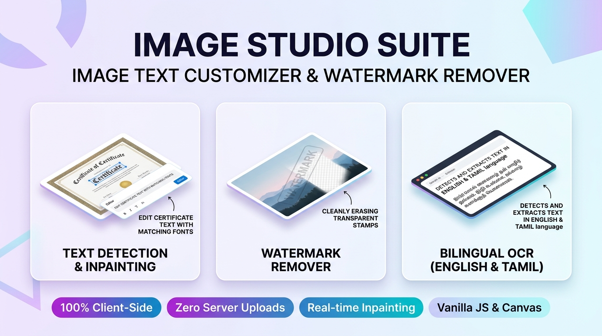

<div align="center">

# 🎨 Image Studio Suite
### Intelligent In-Browser Text Customizer & Watermark Remover

<p align="center">
  
</p>

[](https://vijaymahes9080.github.io/Image-Text-Customizer/)
[](https://vijaymahes9080.github.io/Image-Text-Customizer/)
[-6366f1?style=for-the-badge)](https://vijaymahes9080.github.io/Image-Text-Customizer/)
[-f59e0b?style=for-the-badge)](https://vijaymahes9080.github.io/Image-Text-Customizer/)
[](LICENSE)

<p align="center">
  <a href="https://vijaymahes9080.github.io/Image-Text-Customizer/"><b>🌐 Launch Suite Portal</b></a> •
  <a href="https://vijaymahes9080.github.io/Image-Text-Customizer/image%20text%20changer.html"><b>📝 Image Text Customizer</b></a> •
  <a href="https://vijaymahes9080.github.io/Image-Text-Customizer/watermark%20reomover.html"><b>💧 Watermark Remover</b></a>
</p>

</div>

---

## 🌟 Overview

**Image Studio Suite** is an advanced, browser-native digital imaging toolkit designed for high-precision text manipulation and watermark removal. Built entirely with **HTML5 Canvas, Vanilla ES6+ JavaScript, and client-side Web Workers**, the entire application runs directly in your browser with **zero backend dependencies, zero telemetry, and 100% privacy**.

Whether you need to update dates on event posters, customize recipient names on achievement certificates, or erase distracting watermarks from imagery, Image Studio Suite does it seamlessly without blurry artifacts or crude white boxes.

---

## 📸 Visual Showcase & Workflow

### 1. 📝 In-Browser Text Customizer (`image text changer.html`)

Detect, inpaint, and edit existing text embedded inside images with pixel-matched typography and seamless background restoration.

<p align="center">
  
</p>

#### 🔍 How It Works:
1. **Multi-Pass OCR Detection**:
   - Powered by in-browser [Tesseract.js](https://tesseract.projectnaptha.com/) with dedicated English (`eng`) and Tamil (`tam`) models.
   - Dynamic luminance detection with automatic contrast inversion for light text on dark backgrounds.
   - Intelligent baseline clustering that merges adjacent words into natural phrases without combining distant headers and footers.
2. **Intelligent Inpainting & Background Restoration**:
   - Samples perimeter pixel variance around the text region to automatically apply:
     - **Median Solid Color Fill** for flat vector backdrops.
     - **Directional Linear Gradient Interpolation** for smooth shaded backgrounds.
     - **Bilinear Texture Synthesis** with edge feathering to completely erase original glyphs without leaving traces.
3. **Exact Font & Style Matching**:
   - Measures font metrics (`actualBoundingBoxAscent` + `actualBoundingBoxDescent`) on an offscreen canvas to match the exact font size, weight, line height, and color of the original image text.

<br>

<div align="center">
  <table>
    <tr>
      <td width="50%" align="center">
        <b>⚡ Quick Edit & Style Modal</b><br><br>
        
      </td>
      <td width="50%" align="center">
        <b>✨ Finished Customized Result</b><br><br>
        
      </td>
    </tr>
  </table>
</div>

---

### 2. 💧 Watermark Remover (`watermark reomover.html`)

Cleanly identify and erase semi-transparent watermarks, stamps, and logos in single images or across batch queues.

<div align="center">
  
</div>

- **Automatic Watermark Detection**: Scans edges and high-contrast zones to locate typical watermark positions.
- **Manual Precision Brush**: Paint directly over custom stamps or complex watermarks with adjustable brush sizing.
- **Mathematical Reconstruction**: Inverts alpha blending equations and applies multi-pass patch synthesis for clean texture recovery.
- **Bulk Queue Processing**: Process entire batches of images simultaneously and download as a unified ZIP archive.

---

## ⚡ Feature Comparison

| Feature | Cloud AI Tools | Traditional Desktop Apps | 🎨 Image Studio Suite |
|---|:---:|:---:|:---:|
| **Server Uploads** | Required (Privacy Risk) | None | **Zero (100% In-Browser)** |
| **Subscription / Cost** | $15–$30 / month | Expensive License | **100% Free & Open Source** |
| **Resolution Preservation** | Compresses / Limits Size | Full Resolution | **Lossless Native Resolution** |
| **Tamil Language OCR** | Rare / Unsupported | Manual Plugin | **Built-in Native Support** |
| **Installation** | Heavy App / Browser Extension | Heavy Installer | **Zero Install (Instant Web)** |
| **Speed** | Network dependent | CPU dependent | **Hardware Accelerated Canvas** |

---

## 🛠️ Architecture & Technical Stack

```
Image-Text-Customizer/
│
├── index.html                   # Suite portal linking both flagship tools
├── image text changer.html      # Flagship Image Text Customizer application
├── watermark reomover.html      # In-Browser Watermark Remover & Batch Engine
│
├── css/
│   └── style.css                # Fluid CSS design tokens (Light & Dark themes)
│
├── js/
│   ├── app.js                   # Application coordinator & event dispatcher
│   ├── ocr.js                   # Preprocessed multi-pass Tesseract OCR engine
│   ├── background-repair.js     # Bi-harmonic patch inpainting & gradient restoration
│   ├── canvas-editor.js         # Interactive HTML5 Canvas engine with exact metric matching
│   ├── text-editor.js           # Typography engine, Quick Edit modal & style synchronization
│   ├── history.js               # Multi-step Undo / Redo history state stack
│   ├── export.js                # Lossless PNG and quality-tuned JPEG export pipeline
│   └── utils.js                 # Matrix math, color analysis, and English/Tamil I18N
│
├── assets/                      # High-resolution screenshots and showcase banners
├── .github/workflows/pages.yml  # Automated GitHub Pages CI/CD deployment
├── image.png                    # LinkedIn & Social Media announcement banner
├── LICENSE                      # MIT Open-Source License
└── README.md                    # Comprehensive documentation
```

### Core Technologies:
- **Core Engine**: HTML5 Canvas API, Web Audio / Workers, Vanilla ES6+ JavaScript.
- **Typography & Font Engine**: Offscreen Canvas `TextMetrics`, Google Fonts (*Inter, Roboto, Times New Roman, Georgia, Noto Sans Tamil*).
- **OCR Engine**: Client-side [Tesseract.js v5](https://github.com/naptha/tesseract.js).
- **Inpainting Engine**: Statistical perimeter luminance sampling, directional linear gradients, and bi-linear neighborhood synthesis.
- **Packaging & Delivery**: Static zero-build structure deployed directly via GitHub Pages.

---

## ⌨️ Keyboard Shortcuts

| Shortcut | Description |
|---|---|
| <kbd>V</kbd> | Activate Select / Pointer Tool |
| <kbd>T</kbd> | Activate Add Text Tool |
| <kbd>H</kbd> or <kbd>Space</kbd> + Drag | Pan Canvas Viewport |
| <kbd>Ctrl</kbd> + <kbd>Z</kbd> | Undo Last Action |
| <kbd>Ctrl</kbd> + <kbd>Y</kbd> / <kbd>Ctrl</kbd> + <kbd>Shift</kbd> + <kbd>Z</kbd> | Redo Last Action |
| <kbd>Enter</kbd> (in Quick Edit) | Apply Text Changes |
| <kbd>Escape</kbd> (in Quick Edit) | Cancel & Close Quick Edit Modal |
| <kbd>Delete</kbd> / <kbd>Backspace</kbd> | Delete Selected Text Object |
| <kbd>Mouse Wheel</kbd> | Smooth Cursor-Centered Zoom |

---

## 🚀 Running Locally

You can run the entire suite locally without any build steps or complex dependencies:

### Option 1: Python HTTP Server
```bash
# Clone the repository
git clone https://github.com/vijaymahes9080/Image-Text-Customizer.git
cd Image-Text-Customizer

# Start local server
python -m http.server 8080
```
Open [http://localhost:8080](http://localhost:8080) in your web browser.

### Option 2: Node.js
```bash
npx serve .
# or
npx http-server -p 8080
```

---

## 📢 LinkedIn Post Asset

The project includes an optimized, high-resolution announcement banner formatted for social media:

- **Primary Image File**: [`image.png`](image.png) (also available at [`assets/linkedin-post.png`](assets/linkedin-post.png)).
- Ready to attach when sharing the project on LinkedIn, Twitter/X, and developer portfolios.

---

## 👤 Author & Maintainer

<table style="border: none;">
  <tr>
    <td>
      <h3>Vijay Mahes</h3>
      <p>
        Full-Stack Engineer &amp; Open-Source Creator<br>
        📧 <b>Email:</b> <a href="mailto:Vijaypradhap2004@gmail.com">Vijaypradhap2004@gmail.com</a><br>
        🐙 <b>GitHub:</b> <a href="https://github.com/vijaymahes9080">@vijaymahes9080</a><br>
        ⭐ <b>Project Repository:</b> <a href="https://github.com/vijaymahes9080/Image-Text-Customizer">Image-Text-Customizer</a><br>
        🌐 <b>Live Deployment:</b> <a href="https://vijaymahes9080.github.io/Image-Text-Customizer/">Live Suite Portal</a>
      </p>
    </td>
  </tr>
</table>

---

## 📄 License

This project is licensed under the **MIT License** — see the [LICENSE](LICENSE) file for complete details.
